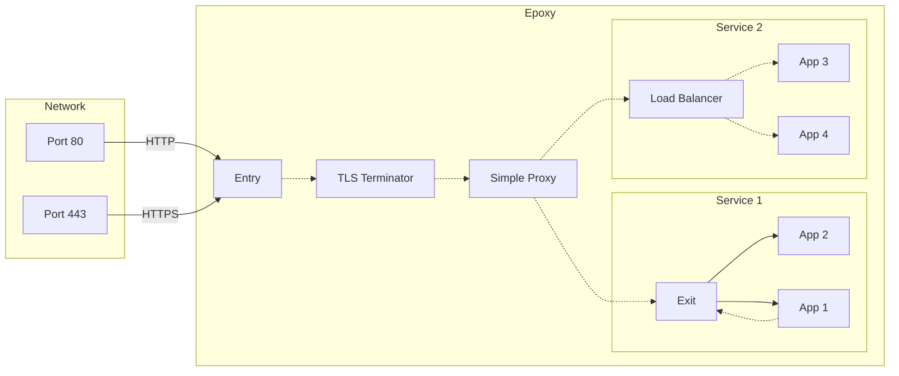

# Epoxy

_2022-02-07_

Epoxy (`org.enqueue.epoxy`) was to be a collection of simple, composable
reverse proxies.  Each proxy performs a single role and are designed to be
connected together into a pipeline.  The concept arose from my work on
[Dirigo](../dirigo) and frustrations with setting up existing reverse proxy
tools.

- Add more thorough plan and emphasise symplicity and security.
- inetd implementation using named pipes rather than standard streams.
- Replace HTTP server in your application with streams.  Your app doesn't
  need to know anything about networking.
- Master pipe tekking listener about new named pipes. Or use inotify?
- Enqueue Epoxy Protocol


## Rationale

<!-- TODO: write like a story -->


### Abstract


### The problem


### The idea


### Need to get faster

- named pipes solve latency issues and reduce traffic on the network stack.
- important if running lots of little reverse proxies.


### Taking it to the extreme

- pull out the entire network stack from your application
- solves various problems:
  - new programming languages won't need to write an entire network/HTTP server library.
  - if you don't like Epoxy's multiple proxy concept, you can write another
    HTTP server which implements the same interface and all per-language Epoxy
    libs will support it.
  - use more robust and conformant HTTP and networking servers.
  - further abstracts the network stack.
  - networking is automatically handled in separate threads.
  - Epoxy libs are more performant and don't clog up the network stack unlike
    traditional reverse proxies.
  - if your application doesn't need to perform network requests, it'll be more
    secure as you won't include that code.


| Name | Description |
|------|-------------|
| `epoxy-entry` | Handles incoming network requests and sends responses.  (Always running.) |
| `epoxy-exit` | Handles outgoing network requests and responses.  (Temporary.) |
| `epoxy-ttp` | Handles TLS Termination and certificate management/renewal. |
| `epoxy-srp` | Simple proxy to select request destination. |
| `epoxy-slb` | Simple load balancer using weighted round robin. |
| `epoxy-firewall` | Firewall |  |
| `epoxy-wf`  | Web forwarding | Simple web forwarding tool. |
| `epoxy-cdn` | Cache          |  |
| `epoxy-compress` | Compressor     |  |
| `epoxy-eat` | EAT |  |

## Examples



```
https://www.example.com/index.html
  |> ttp:443
  |> srp:80
  |> slb:5001
  |> http://localhost:3001 | http://localhost:3002

https://www.example.com/index.html
  |> ttp:443
  |> http://localhost:3001

http://www.example.com/index.html
  |> srp:80
  |> http://localhost:3001
```


## Rationale

Many existing proxies (e.g. Caddy, Traefik, nginx, Envoy, etc.) are highly
complex and packed full of functionality that most users will likely never
need.  The pointless layers of abstraction, while useful, make them extremely
difficult to understand, especially when compared to how simple the underlying
concepts really are.

Epoxy is an attempt to create miniature versions of each part of a traditional
reverse proxy which compose together, and with your applications and services
to form a pipeline.  It trades (a little) performance and memory for
simplicity, security, reliability and composability.

---

- Network
  - https://en.wikipedia.org/wiki/OSI_model
  - https://en.wikipedia.org/wiki/WebSocket
  - https://en.wikipedia.org/wiki/Inetd
  - https://en.wikipedia.org/wiki/TLS_termination_proxy
  - https://en.wikipedia.org/wiki/Reverse_proxy
  - https://en.wikipedia.org/wiki/Load_balancing_(computing)
  - https://queue-fair.com/why-use-a-rate-based-virtual-waiting-room

- TLS
  - https://tls.ulfheim.net/
  - https://tls13.ulfheim.net/

- Cryptography
  - https://nacl.cr.yp.to/
  - https://doc.libsodium.org/

- DJB
  - http://www.catb.org/%7Eesr/writings/taoup/html/ch06s06.html
  - https://news.ycombinator.com/item?id=21707928
  - https://www.oilshell.org/blog/2017/01/13.html

- Named pipes
  - https://en.wikipedia.org/wiki/Named_pipe
  - https://stackoverflow.com/questions/175579/what-are-named-pipes
  - https://stackoverflow.com/questions/44835714/read-continuously-from-a-named-pipe-using-java
  - https://stackoverflow.com/questions/29583985/reading-continuous-data-from-a-named-pipe
  - https://unix.stackexchange.com/questions/68146/what-are-guarantees-for-concurrent-writes-into-a-named-pipe
  - https://www.digitalocean.com/community/tutorials/how-to-share-data-between-docker-containers

- POSIX signals
  - https://github.com/pyr/signal

- EFF Certbot and Let's Encrypt
  - https://eff-certbot.readthedocs.io/en/stable/using.html#standalone

- Building a reverse proxy
  - https://auth0.com/blog/building-a-reverse-proxy-in-dot-net-core/
  - https://gist.github.com/jbardin/821d08cb64c01c84b81a
  - https://hackernoon.com/writing-a-reverse-proxy-in-just-one-line-with-go-c1edfa78c84b
  - https://www.geeksforgeeks.org/creating-a-proxy-webserver-in-python-set-1/

- Alternatives
  - Traefik
    - https://pentacent.medium.com/lets-encrypt-for-your-docker-app-in-less-than-5-minutes-24e5b38ca40b
    - https://doc.traefik.io/traefik/https/acme/
  - Envoy
    - https://www.envoyproxy.io/

- Go
  - https://go.dev/blog/tls-cipher-suites

- Clojure
  - https://github.com/clj-commons/aleph
  - https://www.reddit.com/r/Clojure/comments/52g18d/how_do_i_do_network_programming_in_clojure/

- cdb: local key-value hash database
  - https://cr.yp.to/cdb.html
  - http://thedjbway.b0llix.net/cdb/introduction.html

- Design
  - Simplicity and security.
  - Weird
    - Design, Composition, and Performance — Rich Hickey: https://www.youtube.com/watch?v=QCwqnjxqfmY
    - DJB
      - https://cr.yp.to/qmail/qmailsec-20071101.pdf
      - http://thedjbway.b0llix.net/djbwhy.html
    - Lisp/Clojure
    - Dislike: C, Go, Unix, DOS, the WWW.
      - But this is what we're (currently) stuck with, so let's make it work well.
    - But somewhat like: GNU and OpenBSD

---

- Reverse proxy.
- Load balancer.
- TLS terminator proxy.
  - Automatically generate certificates.
  - Work with certificates created elsewhere.
  - Also work within an internal network.
  - Test with https://www.ssllabs.com/ssltest/ and Curl
  - Set challenge type.
  - epoxy-ttp --port 443 --continue http://localhost:80
  - Auto-regenerate certificates.
    - crontab epoxy-ttp-refresh
  - Use certbot under the hood or custom implementation?
  - Store certificate definitions as files, first line of file is main DNS
    record, others are alts:
      certdefs/
        axvr
          axvr.uk
          www.axvr.uk
          ascribe.axvr.uk
        enqueue
          enqueue.org
          www.enqueue.org
          api.enqueue.org
        nq
          nq.to

- Custom inetd and/or httpd?

- Excellent Docker and Docker compose support.

- Logging and health checks.
- Dynamic config loading?
- HTTPS redirection.
- Manifold/Aleph (see Everything will Flow talk.)
- Bernstein chaining.
- Write in Go or Common Lisp?
  - Self-contained (reasonably small and fast) binaries.
  - Use s-expr for config?
  - May need Golang 1.17+ for better crypto/tls lib.
- Layer 4 and 7 proxy.
  - Layer 4 (TCP, UDP, etc.)
  - Layer 7 (HTTP, HTTPS, Websockets, etc.)
- TLS 1.3 (and maybe 1.2) only.

- Use named pipes (layer 5) to stream data to and from each proxy.
  - Might be faster than sending data over the network back to localhost.
    - Also frees up network resources.
  - Will this work (well?) with Docker?
  - Master pipe which sends a name of an in and out stream for the other
    service to listen to.
  - Example:
      epoxy-ttp --in 443 --out ttp-nq
      clojure -X:prod:run :in 'ttp-nq'
  - Named pipe as only mechanism, but use epoxy-req to make actual requests by
    streaming the input to it, and providing it a file handle for the response.
    - This means that only one proxy contains an HTTP/TCP server.  COMPOSABILITY!
    - Need an entry "proxy" too.  Listens to incoming HTTP requests and streams
      them to next process.
    - This means that security issues can be contained.  A security bug is less
      likely to gain control of your entire application.
  - Inetd used stdin and stdout for requests and responses respectively.
    - Can Epoxy just pass named pipes around?

- May need to write an (optional) orchestrator to automatically manage all this?

- Better DOS protection as requests can be rejected by the server?

- If you have a sidecar reverse proxy in front of your app, you now have 2 HTTP
  servers running.

- HTTP mocking proxy.
- Mock service proxies for testing and local dev.
  - Redis, memcached, DBs, SMTP servers, etc.

- Epoxy DNS proxy

- Super-server mode
  - Improved memory and power efficiency, but slower processing time.
  - Choose which proxies on network should be behind a super-server.
