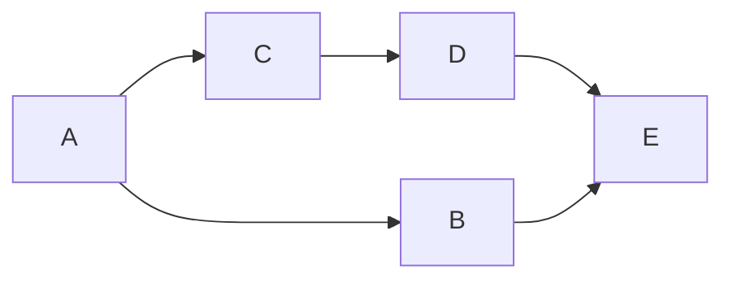

An experimental, simple, Lisp-based hardware description language.

---

- Programming languages are great, but they aren't the only type of computer language.
- DSLs
- Hardware
- Interesting properties
- (I'm by no means, anything close to being an expert)
- Let's take the Lisp and Smalltalk model and apply it to hardware.
- Logic gates and wires
- Let's abstract it a bit.  Logic modules and connections.
- Recursion on the concept of a logic module.
- How should it work?
- Possibly unique evaluation model?
- Construct higher level components from lower level ones
- The higher we build up, the less it looks like an HDL and more like a generic network simulator/communication system.  (Makes sense since it was heavily inspired by the original concepts behind Smalltalk of communicating cells.)
- Implementation:
	- Clojure
	- Slow (but could be significantly faster, performance is not a goal of this implementation)
- Some goals:
	- Graphical IDE,
	- time travelling simulator,
	- FPGA synthesis

---

## Fixing Machina's race conditions

Given the following module graph:

As module out routes are synchronised concurrently, it is not deterministic which of `D` or `B` will trigger a resync of module `E`.  Similarly, `E` *may* be resynced twice.

(Whether `E` behaves correctly under this requires knowledge of the internals of `E`.  Since the simulator knows about its internals we may be able to warn on it, or even optimise the problem away?)

This is a race condition.  The big question is: how can this be resolved?

Posible solutions:

1. ~~Buffer modules.~~  (Inelegant hack; creates redundant code.)
2. Wait for resync of **all** inputs before resync.
3. Manually `await` resyncs of specific inputs.
4. ~~Clocks.~~  (Not ideal for asynchronous circuits.)
5. Embrace.  (Smarter optimisation?)
6. ~~Arbiters.~~  (Fragile and confusing.)

I will implement `2` as an initial solution, however, I suspect that the right combination of `3` and `5` will be superior, so may experiment with that at a later date.

Unfortunately this will likely have a negative impact on performance, however it should be mostly solvable with smarter optimisation.

### Resources

- https://en.wikipedia.org/wiki/Race_condition
- https://en.wikipedia.org/wiki/Metastability_(electronics)
- https://en.wikipedia.org/wiki/Arbiter_(electronics)
- https://en.wikipedia.org/wiki/Logic_redundancy
